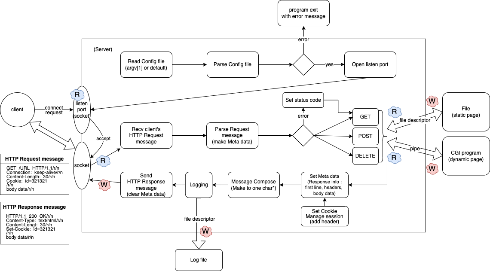

[학습 정리 노션 링크](https://helpful-eggplant-ec3.notion.site/webserv-2b91ab553d214e6ca2889113ededf994)
[팀 레포지터리](https://github.com/FareWellWebServer/webserv.git)

# webserv

# 1. 무엇을 하는 과제인가?
- http web server 구현 (like NGINX)
- socket programming
- I/O multi plexing
- event-driven I/O (Non-block)
- cookie & session
- CGI

  

# 2. Architecture

  

# 3. 팀프로젝트 중 기여한 파트
- event-driven I/O 설계
- MetaData 설계 및 구현
- MsgComposer 설계 및 구현
- HTTP Request 파싱
- CGIManager 설계 및 구현
- Cookie & Session 설계 및 구현

  

# 4. 어려웠던 점 및 해결
## non-block에 대한 잘못된 이해
- fd를 non-block으로 해놓으면, I/O 요청을 커널에게 보내놓고 어플리케이션은 다음 코드를 계속 실행하는 줄 알았음
- non-block이라고 하면, I/O요청을 했을 때 아직 받아올 것이 없으면 return -1과 errno를 받는 것임. 어플리케이션 코드에서 나중에 다시 I/O 요청을 해야되는 것임
- event를 탐지하여, event가 발생한 fd에 대해서만 I/O를 해주면 block될 일이 없으니, non-block인것 처럼 동작하는 거였음

## 이벤트 함수 kqueue 잘 사용하기
- kqueue가 반환하는 kevent 구조체에 많은 정보들이 담겨있음
- process에 대한 event도 설정해줄 수 있고, I/O event 발생시 몇 byte 할 수 있는지도 확인할 수 있음
- 메뉴얼을 꼼꼼히 살펴보고, 구현하다가 중간중간 또 살펴볼 필요가 있음

## connection 상태의 소켓에서 0 byte인 read event 발생
- connection 상태를 확인하는 ping이 아닐까 생각해봄... 검색해도 잘 나오지 않았고 chatGPT도 명쾌한 해답을 주지 못했음..
- ping이라고 판단했고, pong으로 반환해 줌

## 사용한 fd는 적절한 때에 close 해주기
- 파일 입출력이 끝났다고 close하면 안되고, 그 fd 값이 유효한 상태가 끝날 때까지 close 해줘야 함
- 파일 입출력 끝난 직후 close했더니, 그 fd가 다른 파일/소켓에 할당돼서 event 탐지할 때 꼬이기도 했음

  

# 5. 보완할 점
- socket read에 HTTP가 중간에 끊어져서 와도 받아줄 수 있게 하기
- method 처리에서 CGI를 GET 안에 넣지 말고, URL에 따라 따로 뺴주기
- 객체 설계하기 : 객체간의 메시지를 주고 받는 형식으로 잘 설계해보고 싶음
- metadata에 대한 의존성, 복잡성 줄이기. 한 객체에 모든 정보를 넣지 말기
